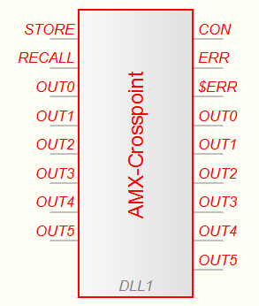

# Extron Matrix DLL

This DLL allows to control Extron matrix switchers like the [Matrix 3200 Series](https://www.extron.com/product/matrix3200) and [Matrix 6400 Series](https://www.extron.com/product/matrix6400) from your [ProfiLab](http://www.abacom-online.de/html/profilab.html) project.

## Input Pins

Name   | Value Range       | Value Interpretation
-------|-------------------|---------------------
STORE  | 0 .. ?            | 0: do nothing *n*: Store to preset *n*
RECALL | 0 .. ?            | 0: do nothing *n*: Recall from preset *n*
OUT*n* | 0 .. *num inputs* | 0: Clear the output *n* *x*: Route input *x* to output *n*
$INS   | *text*            | semicolon-separated list of names for input ports
$OUTS  | *text*            | semicolon-separated list of names for output ports

For all pins decimal places are cut off. **DO NOT** pass negative numbers, the behavior is undefined.

## Output Pins

Name   | Value Range       | Value Interpretation
-------|-------------------|---------------------
CONN   | 0 .. 5            | 0: not connected 1: connected
ERR    | 0 .. 5            | 0: no error 1: error
$ERR   |                   | Textual representation of the error
OUT*n* | 0 .. *num inputs* | 0: No input is routed to output *n*  *x*: Input *x* is routed to output *n*
$INS   | *text*            | semicolon-separated list of names for input ports
$OUTS  | *text*            | semicolon-separated list of names for output ports

## `$INS` and `$OUTS`

The number of items in each list doesn't have to match the number of existing inputs or ouputs. Given a switcher with 64 ouputs the text `CAM 1;CAM 2;CAM 3` is valid and will only change the names of the first three outputs.
